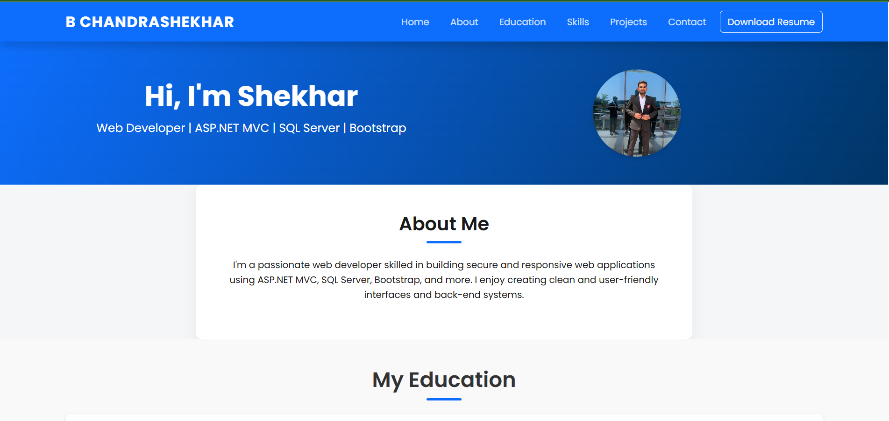

# 🌐 Personal Portfolio Website

This is my personal portfolio website built using **HTML**, **CSS**, and **JavaScript**. It showcases my projects, technical skills, and ways to connect with me.

## 🔗 Live Website

## 🛠️ Tech Stack

- HTML5
- CSS3
- JavaScript (Vanilla)

## 📂 Features

- Responsive design for all screen sizes
- Project showcase section
- Smooth scrolling navigation
- Contact section with social media links

## 🖼️ Screenshots

## 🚀 Future Improvements

- Add dark/light mode toggle
- Integrate contact form with backend
- Add animation using GSAP or AOS

## 📬 Contact

- **LinkedIn:** [linkedin.com/in/yourname](https://linkedin.com/in/shekhar01)
- **GitHub:** [github.com/yourusername](https://github.com/SHEKHARRAO)

---

## 📄 License

This project is licensed under the [MIT License](LICENSE).

